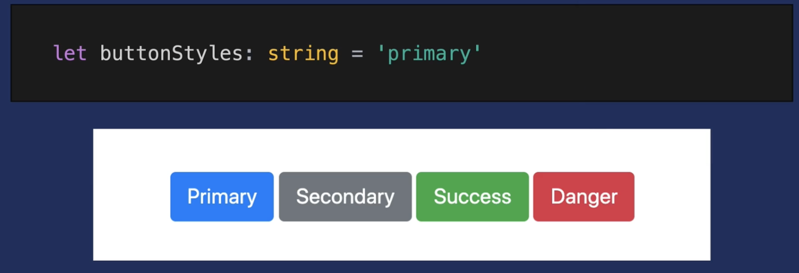

# Typescript


[https://www.typescriptlang.org/](https://www.typescriptlang.org/)

Only during developement - not during runtime

------

```
npm install -g typescript
```

```
tsc
```

------

#### vscode

- eslint
- path intellisense
- prettier

# Type Fundamentals

One of TypeScript’s fundamental concepts is the ability to define static types that can be used to enhance development

## Overview of Types

### Basic Types

As a quick review, common JavaScript types that we often encounter in our code include:

- String
- Number - only one number type - (no int, float)
- Boolean - not truthy values - just true/false
- Array
- Function
- Object

More about what types and data structures exist in JavaScript: [MDN’s documentation on JavaScript Data Types and Data Structures](https://developer.mozilla.org/en-US/docs/Web/JavaScript/Data_structures).

### New Types from TypeScript

TypeScript also offers additional types commonly found in other programming languages such as:

- `any` - allows you to assign any type to the variable = disabling type checking

- `tuple` - allows you to define an array that contains a fixed number of elements with certain types

- `enum` - allows you to define friendly names to sets of numeric values

  ```typescript
  enum ArrowKeys {
  	Up = 1,
  	Down = 2,
  	Left = 3,
  	Right = 4
  }
  ```

and more: check out the [official documentation on TypeScript Basic Types](https://www.typescriptlang.org/docs/handbook/basic-types.html)

## How to Apply a Type to a Variable

add a colon `:`

### String, Number and Booleans

this is accomplished by appending our variable with the `:` and the desired type (lowercase):

```typescript
let stageName: string = 'A Beautiful Vue'
let roomSize: number = 100
let isComplete: boolean = false
```

#### Type Inteference

not necessary to write: (possible, but bad practice)

```tsx
let number1: number = 5
```

enough to write

```tsx
let number1 = 5
```

> ### TypeCasing
>
> In TypeScript, you work with types like `string` or `number` all the times.
>
> **Important**: It is `string` and `number` (etc.), **NOT** `String`, `Number` etc.
>
> **The core primitive types in TypeScript are all lowercase!**

------

### Arrays

TypeScript is about being more explicit about what types are expected in the array, so the notation for defining arrays is a little bit different.

```tsx
let shoppingList: string[] = ['apple', 'bananas', 'cherries']
```

array of strings

```ts
hobbies: string[]
```


```ts
let favoriteActivities: string[];
```

```ts
let favoriteActivities: any[];
```

---

### Function

two key parts:

- Parameters
- Return-Types

this

```js
let generateFullName = (firstName, lastName) => {
  return firstName + ' ' + lastName
}
```

becomes this:

```tsx
let generateFullName = (firstName: string, lastName: string): string => {
  return firstName + ' ' + lastName
}
```

- define the types of the parameters
- define ths type of data the function returns: colon (i.e., `:`) after the parameters.


### Object

If we wanted to define the types that are expected for each key-value pair in the person object, we define the types through the following syntax:

```tsx
let person: {
  name: string;
  age: number;
  activeAvenger: boolean;
  powers: string[];
} = {
  name: 'Peter Parker',
  age: 20,
  activeAvenger: true,
  powers: ['wall-crawl', 'spider-sense']
}
```

the type is not a traditional object because there are semi-colons (i.e., `;`) instead of commas (i.e., `,`).

#### best practice:

not right:

```tsx
const person: object = {
  name: 'Maximilian',
  age: 30
};
```

you can write: (the same)

```tsx
const person: {} = {
  name: 'Maximilian',
  age: 30
};
```

define, but not best-practice:

```tsx
const person: {
  name: string;
  age: number
} = {
  name: 'Maximilian',
  age: 31
};
```

looks lik a js-object, but has `;` and key-type-pairs

better: just let ts infer the types:

```tsx
const person = {
  name: 'Maximilian',
  age: 30
};
```

---

## Interface

Think about it is a way to define a `type` for an object.

Just like a `type`, you declare an `interface` by prefixing the variable name with `interface`:

```typescript
interface Hero {
	name: string;
	age: number;
	activeAvenger: boolean;
	powers: string[];
}
```

### use `type` in an interface

```ts
type ComicUniverse = 'Marvel' | 'DC'

interface Hero {
	name: string;
	age: number;
	activeAvenger: boolean;
	powers: string[];
	universe: ComicUniverse;
}
```

> To get started, use `interface` for objects, `type` for everything else…

------

## Nested objects

object types can also be created for **nested objects**.

Let's say you have this JavaScript **object**:

```ts
const product = {  
	id: 'abc1',  
	price: 12.99,  
	tags: ['great-offer', 'hot-and-new'],  
	details: {    
		title: 'Red Carpet',    
		description: 'A great carpet - almost brand-new!'  
	}
}
```

This would be the **type** of such an object:

```ts
{  
	id: string;  
	price: number;  
	tags: string[];  
	details: {    
		title: string;    
		description: string;  
	}
}
```

# Defining Custom Types

When you want to define custom types in TypeScript, there are two methods that account for most scenarios early on: `type` and `interface`.

##  `type`

In its simplest form, `type` allows you to define an alias that refers to a specific way that the data should be shaped.

- declare a type



### How to use `type`?

Similar to declaring a variable, you use `type` as a declaration of the variable type.

```typescript
type buttonType = 'primary'
```

## Type-Aliases

use keyword `type`

```ts
type Combinable = number | string;
```

Type aliases can be used to "create" your own types.

```ts
type User = { name: string; age: number };
const u1: User = { name: 'Max', age: 30 }; // this works!
```


------

# Misc. Types

### union operator - define multiple values

to allow a type to contain multiple values, use the union operator.

The union operator can be identified by a single pipe `|`

```tsx
type buttonType = 'primary' | 'secondary' | 'success' | 'danger'
```

we can ensure that all `buttonType` variables have the correct value!

```typescript
// TypeScript will report an error because this doesn't exist in the type!
const errorBtnStyles: buttonType = 'error'

// This variable is type safe!
const dangerBtnStyles: buttonType = 'danger'
```

------

## Tuples

added by TS. Fixed-length-Array (also fixed type)

```ts
role: [number, string] // fixed length and types
```

> .push() is an exeption. this is still allowed

---

## Enums

```
enum { NEW, OLD }
```

Convention: start Uppercase

```ts
enum Role { ADMIN, READ_ONLY, AUTHOR}

const person = {
  hobbies: ['Sports', 'Cooking'],
  role: Role.ADMIN
};
```

define starting number:

```ts
enum Role { ADMIN = 5, READ_ONLY, AUTHOR}
```

---

## Any -  Type

usually avoid

---

## Union Types

allow multiple types

```ts
input1: number | string
```

might be good to add runtime-check (with `typeof`)


## Literal Types

define the values

```ts
resultConversion: 'as-text' | 'as-number'
```

---

### unknown-type

a bit stricter than `any`

might need an extra check in runtime

```ts
let userInput: unknown;
let userName: string;

userInput= 5
userName ='Max'

if(typeof userInput ==='string') {
    userName = userInput
}

```

---

### never-type

this fn never returns - throws an Error

never says this is intended

```ts
function generateError (message: string, code: number) {
    throw {message: message, errorCode: code}
}
```


```ts
function generateError (message: string, code: number): never {
    throw {message: message, errorCode: code}s
}
```

---

## Function Return Types

> ts is not as strict with the return type

define return value:

```ts
function add(n1: number, n2: number):number {
    return n1+n2
}
```

> ts also automatically infers the return-type

#### void

if the function doesn't return anything - often infered by ts

-> makes clear, that you don't expect the fn to return anything!

## Functions as types

possible, but not good:

```ts
let combineValues: Function;
```

better: funcion-types:

```ts
let combineValues: ()=> number;
```

#### callback:

```ts
function addAndHandle(n1: number, n2: number, cb: (num: number)=> void) {
    const result = n1 + n2
    cb(result)
}

addAndHandle(10,20, (result)=> {
    console.log(result)
})
```

---

https://www.typescriptlang.org/docs/handbook/2/everyday-types.html

---


